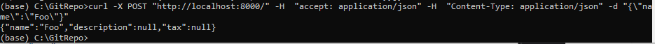

# Source
Using FastAPI to Build Python Web APIs
https://realpython.com/fastapi-python-web-apis/

# Tutorial Author
Sebastian Ramirez (founder Fast API)

# load main.py
uvicorn main:app --reload

# Using JSON

curl -X POST "http://localhost:8000/" -H  "accept: application/json" -H  "Content-Type: application/json" -d "{\"name\":\"Foo\"}"
{"name":"Foo","description":null,"tax":null}

