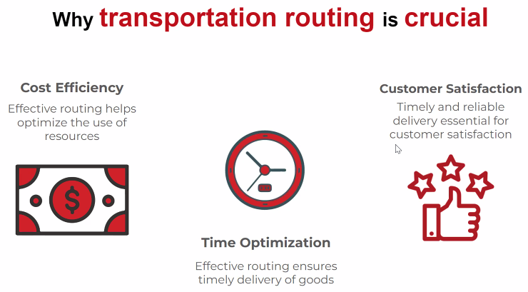
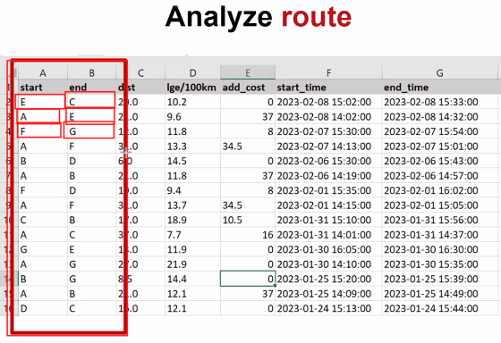
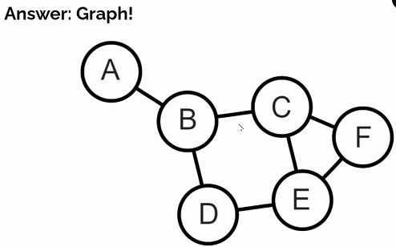
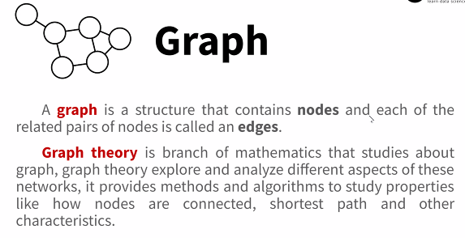
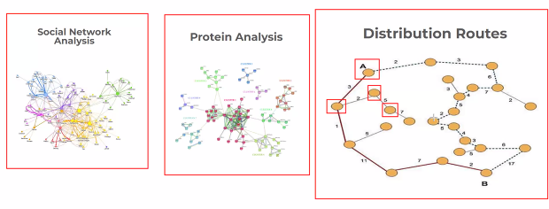
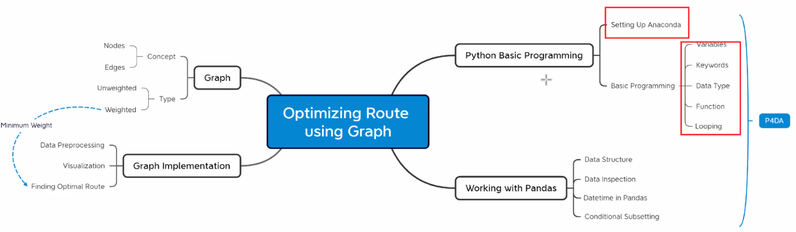

# General Info

https://classroom.google.com/c/NjExNjM0MjMzNTQ4

Selamat datang di kelas Data Science Series dengan Algoritma Data Science School.

Berikut adalah post terkait:
Topik: **DSS: Optimizing Logistics Distribution Routes - A Graph Theory Approach**
Hari: **Selasa - Kamis, 20 - 22 Juni 2023**
Waktu Kelas: **18.30 - 21.30 WIB**
Sesi Q&A (Opsional): **17:45 - 18:05 WIB**

## 

## Day 1

Instructor: Irfan Chairur Rachman

How to Analyze Logistic Distribution Routes?

Answer: Graph

What is Graph?

- Struktur Data yang mengandung nodes dan juga edges
- Theory Graph = ilmut yang mempelajari graph

Example of Implementation

Mindmap

